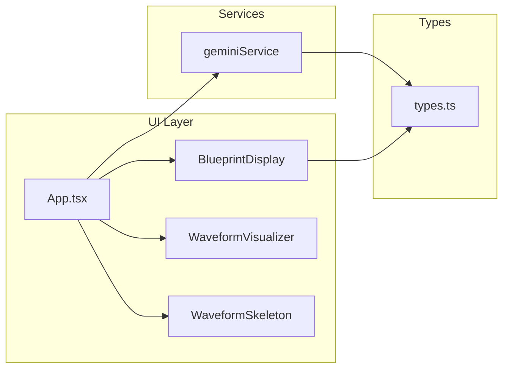

# Repository Review: Sonic Architect (Ableton Deconstructor)

## Summary

Sonic Architect is a React + Vite + Gemini 1.5 Pro web app that analyzes uploaded audio and returns an "Ableton Live 12 Reconstruction Blueprint" (BPM, key, arrangement, instrumentation, FX chain, "secret sauce"). The codebase is small, focused, and already applies solid practices (file validation, CSP, lazy loading, D3/React separation). The main gaps are: no tests or linting, mock-only waveform, missing env/API-key UX, and several small correctness/DX improvements. AGENT_IDEAS.md gives a clear roadmap for future agents (e.g. Session Musician / Audio-to-MIDI).

---

## Strengths

- **Security:** File size limit and type validation before processing; [App.tsx](App.tsx) comments reference Sentinel learnings. CSP in [index.html](index.html) restricts scripts, connects, and media.
- **Performance:** [WaveformVisualizer](components/WaveformVisualizer.tsx) uses separate effects for D3 init vs animation (per [.jules/bolt.md](.jules/bolt.md)); [App.tsx](App.tsx) lazy-loads WaveformVisualizer with Suspense and [WaveformSkeleton](components/WaveformSkeleton.tsx).
- **Accessibility:** Play/pause has aria-label, aria-keyshortcuts, title; Space key handled with focus checks in [App.tsx](App.tsx). Verification scripts in [verification/](verification/) check shortcuts.
- **Types:** Clear [types.ts](types.ts) for `ReconstructionBlueprint` and analysis status; Gemini response parsed and typed.
- **Product vision:** [AGENT_IDEAS.md](AGENT_IDEAS.md) outlines Session Musician, Patch Smith, Mix Doctor, Sample Scout with tech notes.

---

## Issues and recommendations

### Critical

| Area                     | Issue                                                                                                    | Recommendation                                                                                                                                                                                                                                                              |
| ------------------------ | -------------------------------------------------------------------------------------------------------- | --------------------------------------------------------------------------------------------------------------------------------------------------------------------------------------------------------------------------------------------------------------------------- |
| **API key**              | No check before calling Gemini; empty key yields opaque API errors.                                      | In [geminiService.ts](services/geminiService.ts) (or before calling it in App), validate `import.meta.env.VITE_GEMINI_API_KEY` and throw a clear error ("Missing API key. Set GEMINI_API_KEY in .env.local."). Optionally show a one-time banner in UI when key is missing. |
| **Blueprint validation** | Gemini can return JSON that doesn't match [types.ts](types.ts) (e.g. missing or differently named keys). | After `JSON.parse` in [geminiService.ts](services/geminiService.ts), validate shape (e.g. required `telemetry`, `arrangement`, `instrumentation`, `fxChain`, `secretSauce`) and normalize or throw a clear error so the UI doesn't crash.                                   |
| **Tests**                | No unit or integration tests.                                                                            | Add a minimal test setup (e.g. Vitest + React Testing Library). Start with: (1) parsing/validation logic in geminiService, (2) App file-validation and error states, (3) BlueprintDisplay with a fixture blueprint.                                                         |

### Important

| Area                         | Issue                                                                                                                  | Recommendation                                                                                                                                                                                                       |
| ---------------------------- | ---------------------------------------------------------------------------------------------------------------------- | -------------------------------------------------------------------------------------------------------------------------------------------------------------------------------------------------------------------- |
| **Waveform**                 | [WaveformVisualizer](components/WaveformVisualizer.tsx) uses random data, not real audio.                              | Either replace with real waveform (decode audio with Web Audio API, draw peaks) or rename/label as "placeholder" so users and future agents don't assume it reflects the file.                                       |
| **Linting / formatting**     | No ESLint or Prettier.                                                                                                 | Add ESLint (e.g. eslint-config-react, TypeScript) and Prettier; add `lint` and `format` scripts and optionally a pre-commit or CI check.                                                                             |
| **Env documentation**        | No `.env.example`; README references `.env.local` but it's gitignored.                                                 | Add `.env.example` with `GEMINI_API_KEY=` and document in [README.md](README.md) that users should copy to `.env.local` and set the key.                                                                             |
| **useEffect dependency**     | [App.tsx](App.tsx) line 108: `useEffect(..., [togglePlayback, audioUrl])`. `togglePlayback` is recreated every render. | Wrap `togglePlayback` in `useCallback` with `[audioRef, isPlaying]` (or equivalent) so the effect doesn't re-subscribe every render, or remove `togglePlayback` from deps and use a ref for the latest handler.      |
| **Error recovery**           | After an analysis error, user must upload again; no explicit "retry" or "clear error" action.                          | Add a "Try again" or "Dismiss" on the error block and optionally a "Reset" to clear file and blueprint and return to idle.                                                                                           |
| **Analyzer file size limit** | Limit is 10MB in [App.tsx](App.tsx) (`MAX_FILE_SIZE`). Users may want to analyze longer stems or full tracks.          | Increase the limit (e.g. to 50MB or 100MB) in [App.tsx](App.tsx). Optionally make it configurable via env (e.g. `VITE_MAX_UPLOAD_MB`) and keep a sensible default; ensure the error message shows the current limit. |

### Suggestions

| Area                      | Suggestion                                                                                                                                                                                                                         |
| ------------------------- | ---------------------------------------------------------------------------------------------------------------------------------------------------------------------------------------------------------------------------------- |
| **index.html import map** | [index.html](index.html) includes an import map (esm.sh). With Vite, the app is bundled, so this may be for AI Studio or another host. Document when the import map is used vs Vite build, or remove if unused to avoid confusion. |
| **Tailwind**              | Tailwind is loaded from CDN in index.html. For build-size and consistency, consider installing `tailwindcss` and PostCSS and building CSS in the Vite pipeline.                                                                    |
| **Blueprint export**      | Allow downloading the blueprint as JSON (and optionally a readable report) for use in Ableton or other tools.                                                                                                                      |
| **Loading state**         | Consider disabling "Import Stem" or showing a spinner during analysis to prevent double uploads.                                                                                                                                   |
| **Verification**          | Add a short note in README or a `verification/README.md` on how to run the Playwright scripts (e.g. `npm run dev` then `python verification/verify_shortcuts.py`).                                                                 |
| **Footer**                | Update "© 2024" when shipping; consider "Reference Model: Gemini 1.5 Pro" only in dev or a small "About" section.                                                                                                                  |

---

## Architecture overview

- **Data flow:** User uploads file in App → file validated → base64 + MIME sent to `analyzeAudio()` → Gemini returns JSON → parsed to `ReconstructionBlueprint` → stored in state and passed to `BlueprintDisplay`. Audio URL is passed to `WaveformVisualizer` and to a hidden `<audio>` for playback.
- **Key files:** [App.tsx](App.tsx) (state, upload, analysis trigger, playback), [services/geminiService.ts](services/geminiService.ts) (single `analyzeAudio` function), [types.ts](types.ts) (blueprint and status types), [components/BlueprintDisplay.tsx](components/BlueprintDisplay.tsx) (presentation only).

---

## Plan 1 — Critical (must fix)

Address correctness, security, and reliability so the app doesn't fail in unclear ways.

1. **API key check**
   - In [services/geminiService.ts](services/geminiService.ts) (or in App before calling `analyzeAudio`), check `import.meta.env.VITE_GEMINI_API_KEY` and throw a clear error if missing (e.g. "Missing API key. Set GEMINI_API_KEY in .env.local.").
   - Optionally in [App.tsx](App.tsx) show a one-time banner when key is missing so users don't hit the error only after uploading.
2. **Blueprint validation**
   - After `JSON.parse` in [services/geminiService.ts](services/geminiService.ts), validate that the object has required keys: `telemetry`, `arrangement`, `instrumentation`, `fxChain`, `secretSauce` (and that `telemetry` has `bpm`, `key`, `groove`; `secretSauce` has `trick`, `execution`).
   - If invalid, throw a clear error (e.g. "Invalid analysis result; please try again.") so the UI doesn't crash when rendering [BlueprintDisplay](components/BlueprintDisplay.tsx).
3. **Minimal test suite**
   - Add Vitest + React Testing Library.
   - Tests: (1) geminiService — parsing valid JSON into blueprint and throwing on invalid/missing key; (2) App — file size/type validation and error state; (3) BlueprintDisplay — renders with a fixture blueprint without crashing.

---

## Plan 2 — Important (should fix)

Improve UX, DX, and robustness without changing product scope.

1. **Larger analyzer file size**
   - In [App.tsx](App.tsx), increase `MAX_FILE_SIZE` from 10MB to a larger value (e.g. **50MB** or **100MB**). Use a named constant and keep the error message in sync: `(MAX_FILE_SIZE / 1024 / 1024).toFixed(0)}MB`.
   - Optional: make limit configurable via `VITE_MAX_UPLOAD_MB` in [vite.config.ts](vite.config.ts) with a fallback (e.g. 50).
2. **Env documentation**
   - Add `.env.example` with `GEMINI_API_KEY=` (and optionally `VITE_MAX_UPLOAD_MB=50`).
   - In [README.md](README.md), state to copy to `.env.local` and set the key (and mention the file size limit if configurable).
3. **useEffect dependency fix**
   - In [App.tsx](App.tsx), wrap `togglePlayback` in `useCallback` with appropriate deps (e.g. `audioRef`, `isPlaying`) so the keydown effect's dependency array is stable.
4. **Error recovery UI**
   - In the error block in [App.tsx](App.tsx), add "Dismiss" (clear error) and optionally "Try again" (re-run analysis on same file) or "Reset" (clear file + blueprint + error).
5. **Waveform**
   - Either implement real waveform (Web Audio API decode + draw peaks in [WaveformVisualizer](components/WaveformVisualizer.tsx)) or clearly label the current view as "Placeholder" so users and future agents know it's not real audio data.
6. **Linting and formatting**
   - Add ESLint (React + TypeScript) and Prettier; add `lint` and `format` scripts; optionally pre-commit or CI step.

---

## Plan 3 — Suggestions (nice to have)

Lower priority improvements that improve polish and maintainability.

1. **import map**
   - Document in README or a short comment in [index.html](index.html) when the esm.sh import map is used (e.g. AI Studio) vs Vite bundle, or remove it if unused.
2. **Tailwind via build**
   - Install `tailwindcss` and PostCSS and move from CDN in [index.html](index.html) to Vite-built CSS for smaller, consistent builds.
3. **Blueprint export**
   - Add a "Download blueprint" (JSON) and optionally a "Download report" (readable) in [BlueprintDisplay](components/BlueprintDisplay.tsx) or App when a blueprint is present.
4. **Loading state**
   - Disable "Import Stem" (or show spinner) while analysis is in progress to avoid double uploads.
5. **Verification**
   - In README or [verification/README.md](verification/README.md), add how to run Playwright scripts: e.g. `npm run dev`, then `python verification/verify_shortcuts.py`.
6. **Footer**
   - Update "© 2024" when shipping; consider moving "Reference Model: Gemini 1.5 Pro" to an "About" or dev-only section.

---

## Plan 4 — Recommendations (implementation order)

Suggested order to execute the work across the four tiers.

1. **Increase analyzer file size** (Plan 2) — single constant change in [App.tsx](App.tsx).
2. **API key check and message** (Plan 1).
3. **Blueprint validation** in geminiService (Plan 1).
4. **.env.example + README** (Plan 2).
5. **Vitest + RTL and first tests** (Plan 1).
6. **ESLint + Prettier** (Plan 2).
7. **useCallback for togglePlayback** (Plan 2).
8. **Error recovery UI** (Plan 2).
9. **Waveform: real or placeholder label** (Plan 2).
10. **Blueprint export** (Plan 3).
11. **Tailwind via build** (Plan 3).
12. **Remaining suggestions** (Plan 3) as needed.

---

## Future development (from AGENT_IDEAS.md)

- **Session Musician (Audio-to-MIDI)** is called out as the next high-impact feature; can stay client-side with e.g. `@tonejs/midi` and Gemini returning structured note data.
- When adding new agents or features, keep **analysis** in `services/` and **UI** in `components/`; reuse `ReconstructionBlueprint`-style types and validation patterns.

---

## Independent plans

The four plans above are also saved as separate files for independent execution:

- [plans/plan-1-critical.md](plans/plan-1-critical.md) — Critical (must fix)
- [plans/plan-2-important.md](plans/plan-2-important.md) — Important (should fix)
- [plans/plan-3-suggestions.md](plans/plan-3-suggestions.md) — Suggestions (nice to have)
- [plans/plan-4-recommendations.md](plans/plan-4-recommendations.md) — Recommendations (implementation order)

See [plans/README.md](plans/README.md) for a quick index.

---

## Related documentation

- [AGENT_IDEAS.md](AGENT_IDEAS.md) – agent concepts and tech stack.
- [.jules/](.jules/) – bolt (D3/React), palette (focus/a11y), sentinel (file validation).
- [README.md](README.md) – run and deploy; extend with env and verification steps as above.
